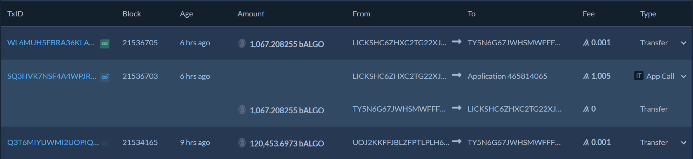
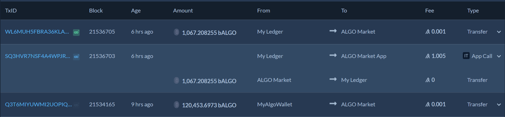
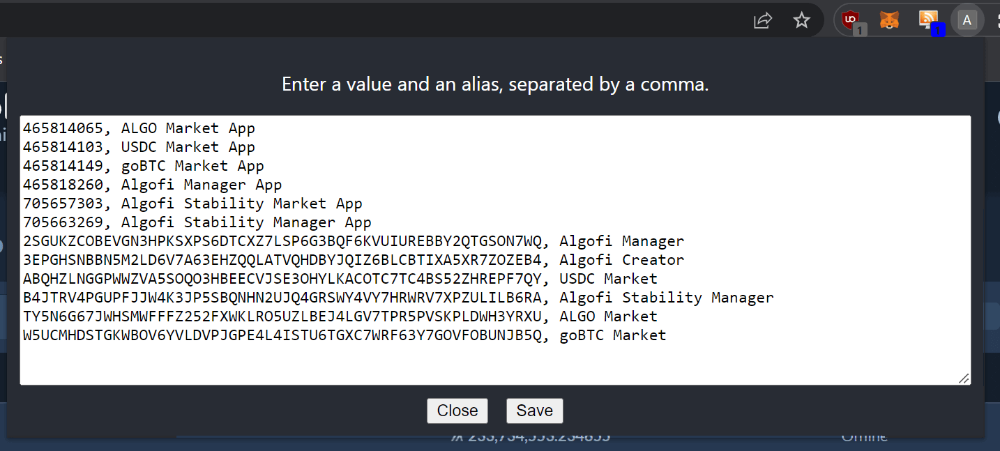

# ALGO alias

A chrome extension that lets you add aliases to [AlgoExplorer](https://algoexplorer.io/).

Turn an address like "7BZEUIEPHZGDK6E673DVOY6BVCCZC6YFAJ3QWROPBZK5XKGE5GUWDYZRUY" into "My Wallet".

or an application ID like "Application 465818260" into "Algofi Manager App"

or application args like "dXA=" into "update prices"

Before:

After:

## Usage

Each line in the text box represents an alias. The first value is the text
you want to replace, the second value is the alias to display.

You can replace any text on the page, think of it as a global find and replace.

See the [example aliases](examples/aliases.txt)

## Installation

The extension is pending a review by the Chrome team.

Until it's approved, you can
get the latest version on the release page: https://github.com/guanzo/algo-alias/releases.

* Download the "algo-alias.tar.gz" file
* Unzip the archive to somewhere on your file system.
* Follow these instructions: https://developer.chrome.com/docs/extensions/mv3/getstarted/#unpacked
